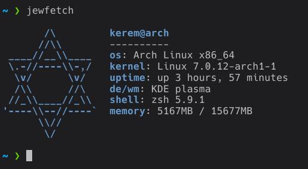

# Jewfetch

jewfetch is a fetching tool written in rust
the name is for entertainment purposes only



# Installation / Uninstallation

```bash
chmod +x start.sh
./start.sh
```
- choose 1 if you want to install by building (recommended)
- choose 2 if you want to install by pre-build binary image
- choose 3 if you want to uninstall

# Configuration

the path that contains config files is `~/.config/jewfetch`

- `config.json`
from here, you can change the commands to be executed for the components

- `options.json`
from here, you can change the ascii art and the colors

ascii arts are stored in `~/.config/jewfetch/ascii-arts`
if you want to create a custom ascii art, create new file here for example: `art.txt`
then set the ascii section into the name of your file that you created previously for example: `"ascii":"art"`

you can also select the color whatever you want from the section color
available colors: `black,red,green,yellow,blue,purple,cyan,white`
default color is blue.

# Disclaimer

this project was created solely for entertainment purposes, and there is no racism involved.
