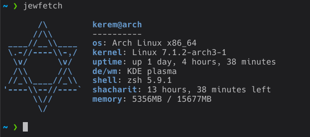

# JewFetch

A fetching tool written in Rust. The name is for entertainment purposes only.



## Installation

```sh
chmod +x start.sh
./start.sh
```

- Choose `1` to install by building (recommended).
- Choose `2` to uninstall.

## Configuration

Config files stores in `~/.config/jewfetch`.

### `config.json`

Set color, ASCII art, and the components to display (and their order).

### Commands

Stored in `~/.config/jewfetch/commands`.  
Create a new command file to add a component, then add its object to `config.json`.

### ASCII arts

Stored in `~/.config/jewfetch/ascii-arts`.  
Create a new file (e.g. `art.txt`), then set `"ascii": "art"` in `config.json`.

### Colors

Available: `black`, `red`, `green`, `yellow`, `blue`, `purple`, `cyan`, `white`.  
Default: `blue`.

## Disclaimer

This project was created solely for entertainment purposes. No racism is intended or involved.
